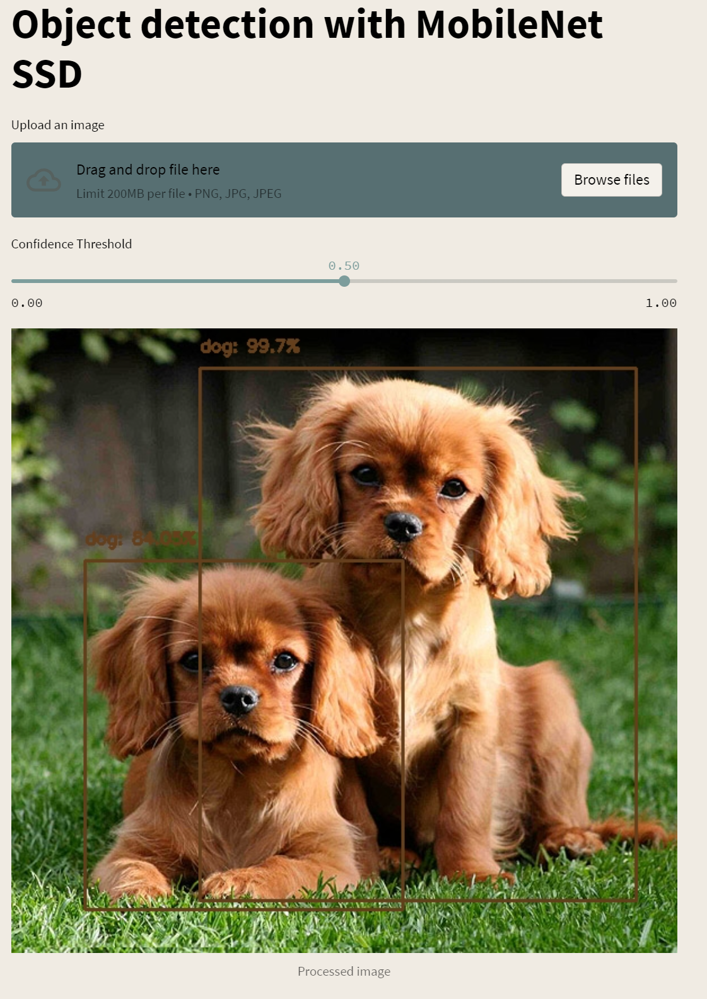

# object-detection-app
Simple object detection app with streamlit. Upload an image and perform object detection. Adjust the confidence threshold to see how this affects predictions.

<p align="center">

</p>

## Installation
```
    conda create -n object-detection-app python=3.8
    conda activate object-detection-app
    pip install -r requirements.txt
```

## Running Streamlit
From the root dir:
```
    streamlit run main.py
```

## References
I took some inspiration from [this article](https://www.pyimagesearch.com/2017/09/11/object-detection-with-deep-learning-and-opencv/) by Adrian Rosebrock.